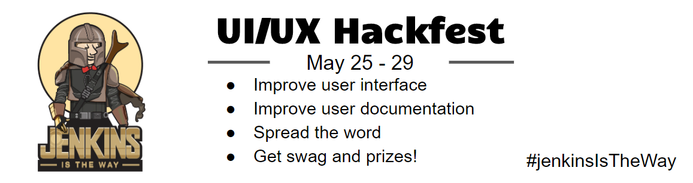
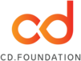

## About the event

[Jenkins UI/UX Online Hackfest](https://www.jenkins.io/events/online-hackfest/2020-uiux/) is an online event on May 25-29.
The goal to improve the Jenkins user experience, including but not limited to user interface and documentation.
We also invite participants to share experiences about Jenkins and to participate in UX testing.
The event will have the [Jenkins is the Way](https://www.jenkins.io/blog/2020/04/30/jenkins-is-the-way/) theme.
You can find more information on the [event page](https://www.jenkins.io/events/online-hackfest/2020-uiux/).

## Tracks and projects

There will be [3 main tracks](https://www.jenkins.io/events/online-hackfest/2020-uiux/#tracks-and-project-ideas):

* **User Interface** - Improve look&feel and accessibility for Jenkins users, work on new read-only interface for instances managed with configuration as code, create and update Jenkins themes, and many other topics.
* **User Documentation** - Improve and create new user documentation, tutorials and solution pages. Also, there is ongoing documentation migration from Wiki to jenkins.io and plugin repositories.
* **Spread the word** - Write user stories for Jenkins Is The Way site and the Jenkins blog, post about your Jenkins user experience and new features, record overview and HOWTO videos, etc.

See [this page](https://www.jenkins.io/events/online-hackfest/2020-uiux/#tracks-and-project-ideas) for the list of project and ideas.

## Resources

* [Main event page](https://www.jenkins.io/events/online-hackfest/2020-uiux/) with all information, e.g. 
  [project ideas](https://www.jenkins.io/events/online-hackfest/2020-uiux/#tracks-and-project-ideas),
  [online events](https://www.jenkins.io/events/online-hackfest/2020-uiux/#online-events),
  [swag and prizes](https://www.jenkins.io/events/online-hackfest/2020-uiux/#swag-and-prizes)
* [Getting started, Reporting cotnributions](./CONTRIBUTING.md)
* [Code of Conduct](https://www.jenkins.io/project/conduct/)
* [Frequently Asked Questions](https://www.jenkins.io/events/online-hackfest/2020-uiux/faq/)

## Contributors

<!-- ALL-CONTRIBUTORS-BADGE:START - Do not remove or modify this section -->

<!-- ALL-CONTRIBUTORS-BADGE:END --> 

<!-- ALL-CONTRIBUTORS-LIST:START - Do not remove or modify this section -->
<!-- prettier-ignore-start -->
<!-- markdownlint-disable -->
<table>
  <tr>
    <td align="center"><a href="https://oleg-nenashev.github.io/"> <b>Oleg Nenashev</b></a> <a href="#eventOrganizing-oleg-nenashev" title="Event Organizing">📋</a> <a href="#talk-oleg-nenashev" title="Talks">📢</a> <a href="https://github.com/jenkinsci/ui-ux-hackfest-2020/commits?author=oleg-nenashev" title="Documentation">📖</a></td>
    <td align="center"><a href="https://jenkins.io/blog/authors/markewaite/"> <b>Mark Waite</b></a> <a href="#eventOrganizing-MarkEWaite" title="Event Organizing">📋</a> <a href="#talk-MarkEWaite" title="Talks">📢</a> <a href="https://github.com/jenkinsci/ui-ux-hackfest-2020/pulls?q=is%3Apr+reviewed-by%3AMarkEWaite" title="Reviewed Pull Requests">👀</a></td>
    <td align="center"><a href="https://tracymiranda.com"> <b>Tracy Miranda</b></a> <a href="#eventOrganizing-tracymiranda" title="Event Organizing">📋</a></td>
    <td align="center"><a href="https://github.com/timja"> <b>Tim Jacomb</b></a> <a href="https://github.com/jenkinsci/ui-ux-hackfest-2020/pulls?q=is%3Apr+reviewed-by%3Atimja" title="Reviewed Pull Requests">👀</a> <a href="#ideas-timja" title="Ideas, Planning, & Feedback">🤔</a> <a href="#talk-timja" title="Talks">📢</a></td>
    <td align="center"><a href="https://twitter.com/markyjackson5"> <b>Marky Jackson</b></a> <a href="https://github.com/jenkinsci/ui-ux-hackfest-2020/pulls?q=is%3Apr+reviewed-by%3Amarkyjackson-taulia" title="Reviewed Pull Requests">👀</a></td>
    <td align="center"><a href="http://www.cs.hm.edu/die_fakultaet/ansprechpartner/professoren/hafner/index.de.html"> <b>Ullrich Hafner</b></a> <a href="#talk-uhafner" title="Talks">📢</a></td>
    <td align="center"><a href="https://github.com/res0nance"> <b>Raihaan Shouhell</b></a> <a href="https://github.com/jenkinsci/ui-ux-hackfest-2020/commits?author=res0nance" title="Documentation">📖</a></td>
  </tr>
</table>

<!-- markdownlint-enable -->
<!-- prettier-ignore-end -->
<!-- ALL-CONTRIBUTORS-LIST:END -->

## Acknowledgements

We thank all contributors who participate in this event as committers!
We especially thank all reviewers, organizers and those who participated in the initial program reviews and provided invaluable feedback.
In particular, we thank User Experience, Documentation and Advocacy and Outreach SIG members who heavily contributed to this event.

We also thank sponsors of the event who make the swag and prizes possible:
[CloudBees, Inc.](https://www.cloudbees.com/) and
[Continuous Delivery Foundation (CDF)](https://cd.foundation/).
In addition to swag, CloudBees donates working time for event hosts and reviewers.
CDF also sponsors our [online meetup platform](https://www.jenkins.io/events/online-meetup) which we will be using for the event.

